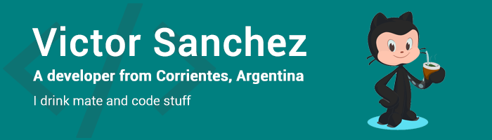

<h1 align="center">Hi human!👋, I'm Victor Sanchez</h1>

- 🔭 I’m currently working on **personal projects 🤓**

- 🌱 I’m currently learning **everything! 😅**

- 👨‍💻 You can visit my web portfolio at [victorsnz.web.app](https://victorsnz.web.app)

- 📫 How to reach me **victor_sanchez@outlook.com** or **sanchez.v.a@gmail.com**

- ⚡ Fun fact **I wrote a tale about a superhero and it got publish on a book 🦸‍♂️**

<h4 align="left">Connect with me:</h4>

    
    

<h4 align="left">Languages and Tools:</h4>

    Arduino / Bootstrap / C# / CSS / .NET / ExpressJS / Firebase / Git / HTML / JavaScript / MySQL / Linux / NodeJS / Photoshop / Postman / React / Adobe XD

